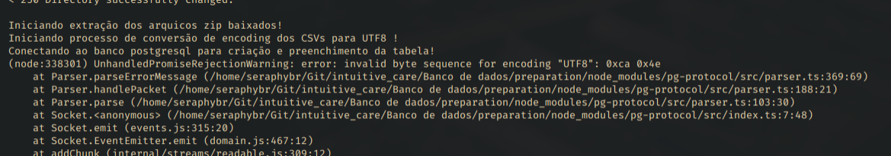

## Testes Intuitive Care
Esse reposítorio contem alguns testes/tarefas realizados para a intuitive care.

### Testes I e II
Como ambos os testes lidam com o mesmo pdf, o teste 1 baixa, e o teste 2 extrai dados dele, tomei a liberdade de juntar.

Para resolução eu criei um projeto nodejs com typescript, localizado na pasta "WebScraping e Transformação de dados".

Para rodar basta entrar na pasta e rodar um `npm install` e `npm start`,
e na pasta static você deve encontrar o pdf baixado, cada csv obtido do pdf, e o zip gerado com meu nome.

### Teste III
Esse teste está localizado na pasta "Banco de dados"

Esse teste eu tentei resolver primeiramente criando um outro projeto nodejs com typescript que
iria cuidar da parte de preparação (baixar todos os csvs necessarios), alem de converter o
encoding dos csvs para utf8, e criar uma tabela no banco PostgreSQL com os dados preenchidos do csv,
para então depois ter um arquivo .sql com as queries.

Inicialmente me dei com o problema de permissão do postgres de poder ler/escrever os csvs baixados
na pasta do projeto, mas consegui resolver isso copiando os csvs para a pasta temporaria
do sistema (`/tmp` em sistemas linux), lugar onde o postgres tem permissão.

Contudo, ainda tive problema com o ultimo campo dos csvs, que são valores com ponto decimal/flutuante.
Como o meu sistema operacional está em inglês, se eu criar a tabela com o campo de tipo `REAL`, ele não aceita, pois,
no Brasil utilizamos `,` para separar as casas decimais e o postgres está configurado para usar `.`.
Enfim é possivel de resolver se eu escrever um código para passar pela coluna e substituir.
Apesar disso, quando mudei o campo da tabela para ser `VARCHAR`, obtive um erro de sequencia de bytes inválida,
e tive que parar ai devido ao meu tempo. Segue print do erro abaixo:

